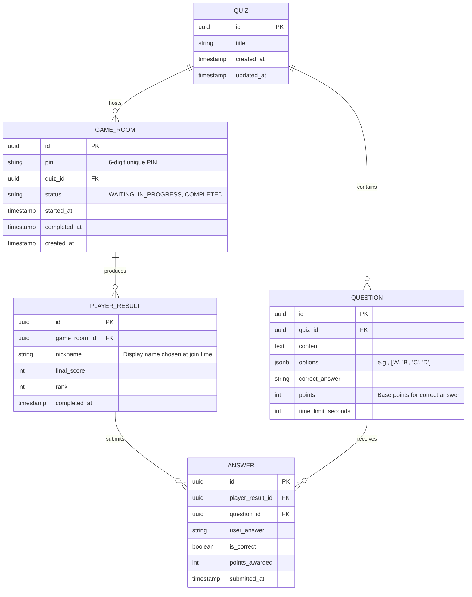

# Database Design: Real-Time Quiz Feature

The persistent storage layer uses PostgreSQL to store structured data ensuring ACID compliance for quizzes, game rooms, and historical results. Redis is used alongside it to manage the volatile real-time state during active sessions.

---

## Entity-Relationship (ER) Diagram



---

## PostgreSQL Tables Description

### 1. `quizzes` Table
Stores quiz template definitions. A quiz is a reusable collection of questions that a master can use to create one or many game rooms.
- `id` (UUID, Primary Key)
- `title` (VARCHAR)
- `created_at` / `updated_at` (TIMESTAMP)

> **Note:** The `status` and `started_at` fields from the old design have been removed. Status now belongs to `GameRoom`, not the quiz template itself, since the same quiz can be played in multiple rooms.

### 2. `questions` Table
Holds the item bank attached to a specific quiz template.
- `id` (UUID, Primary Key)
- `quiz_id` (UUID, Foreign Key → `quizzes.id`): Indexed for fast lookups.
- `content` (TEXT): The vocabulary question being asked.
- `options` (JSONB): An array of possible multiple-choice options (e.g., `["cat", "car", "card", "care"]`).
- `correct_answer` (VARCHAR): The string value of the correct option.
- `points` (INT): Base weight of the question (default: 1000).
- `time_limit_seconds` (INT): Per-question timer used by the game flow service.

### 3. `game_rooms` Table *(New — replaces old `quiz_sessions`)*
Represents a single live game session created by a master. A game room is an ephemeral room backed by Redis during play, and persisted to PostgreSQL for record-keeping.
- `id` (UUID, Primary Key)
- `pin` (VARCHAR(6), Unique): The 6-digit PIN shared by the master to invite players.
- `quiz_id` (UUID, Foreign Key → `quizzes.id`): The quiz template being played.
- `status` (ENUM: `WAITING`, `IN_PROGRESS`, `COMPLETED`): Current lifecycle state.
- `started_at` (TIMESTAMP, nullable): Set when master triggers `start_quiz`.
- `completed_at` (TIMESTAMP, nullable): Set when the last question ends.
- `created_at` (TIMESTAMP)

### 4. `player_results` Table *(New — replaces old `quiz_sessions` + `users`)*
A permanent record of a guest player's final performance after a game room completes. Players are anonymous guests (no user account required); their identity is the nickname they chose on join.
- `id` (UUID, Primary Key)
- `game_room_id` (UUID, Foreign Key → `game_rooms.id`): Indexed.
- `nickname` (VARCHAR): The display name the player entered when joining.
- `final_score` (INT): Total score at end of game, synced from Redis.
- `rank` (INT): Final position on the leaderboard.
- `completed_at` (TIMESTAMP)

### 5. `answers` Table
Detailed tracking of every submitted answer for historical analytics and dispute resolution.
- `id` (UUID, Primary Key)
- `player_result_id` (UUID, Foreign Key → `player_results.id`)
- `question_id` (UUID, Foreign Key → `questions.id`)
- `user_answer` (VARCHAR): The option the player selected.
- `is_correct` (BOOLEAN): Auto-populated during scoring logic.
- `points_awarded` (INT): Speed-adjusted score (factors in time remaining).
- `submitted_at` (TIMESTAMP)


---

## Redis Schema (In-Memory — Runtime State)

All **live game state** lives in Redis. PostgreSQL only persists cold data (room metadata, final results). Redis keys are namespaced by PIN.

### 1. Active Session Object (JSON String)
Full session state used by the Gateway and GameFlowService.
- **Key**: `session:{pin}`
- **Value**: JSON serialized `GameSession` object
- **TTL**: 7200 seconds (2 hours)
```json
{
  "id": "uuid",
  "pin": "483921",
  "quizId": "uuid",
  "gameRoomId": "uuid",
  "status": "in_progress",
  "currentQuestionIndex": 2,
  "questionStartedAt": 1713450183000,
  "players": {
    "socket-id-xyz": { "playerId": "uuid", "nickname": "Alice", "score": 850 }
  }
}
```

### 2. Live Leaderboard (Sorted Set)
Tracks real-time rankings using Redis ZSET.
- **Key**: `session:{pin}:scores`
- **Member**: `{playerId}`
- **Score**: `{current_points}`
- **TTL**: 7200 seconds

*Primary commands*: `ZADD` (init at 0), `ZINCRBY` (on correct answer), `ZREVRANGE ... WITHSCORES` (top 10 fetch).

### 3. Answer Distribution (Hash)
Tracks how many players chose each option during an active question (for showing stats after question ends).
- **Key**: `session:{pin}:q:{question_id}:dist`
- **Fields**: option values (e.g., `"cat"`, `"car"`)
- **Values**: count of players who selected that option
- **TTL**: 3600 seconds

### 4. Idempotency Keys (String)
Prevents double-submission of answers.
- **Key**: `session:{pin}:answered:{question_id}:{player_id}`
- **Value**: `"1"`
- **TTL**: 3600 seconds
- **Command**: `SETNX` (atomic — returns 0 if already exists, aborting duplicate processing)

### 5. Pub/Sub Channels
Event distribution so horizontally scaled server nodes stay in sync.
- **Channel**: `channel:session:{pin}:updates`
- **Payload**: `{ "event": "leaderboard_update", "data": [...] }`
