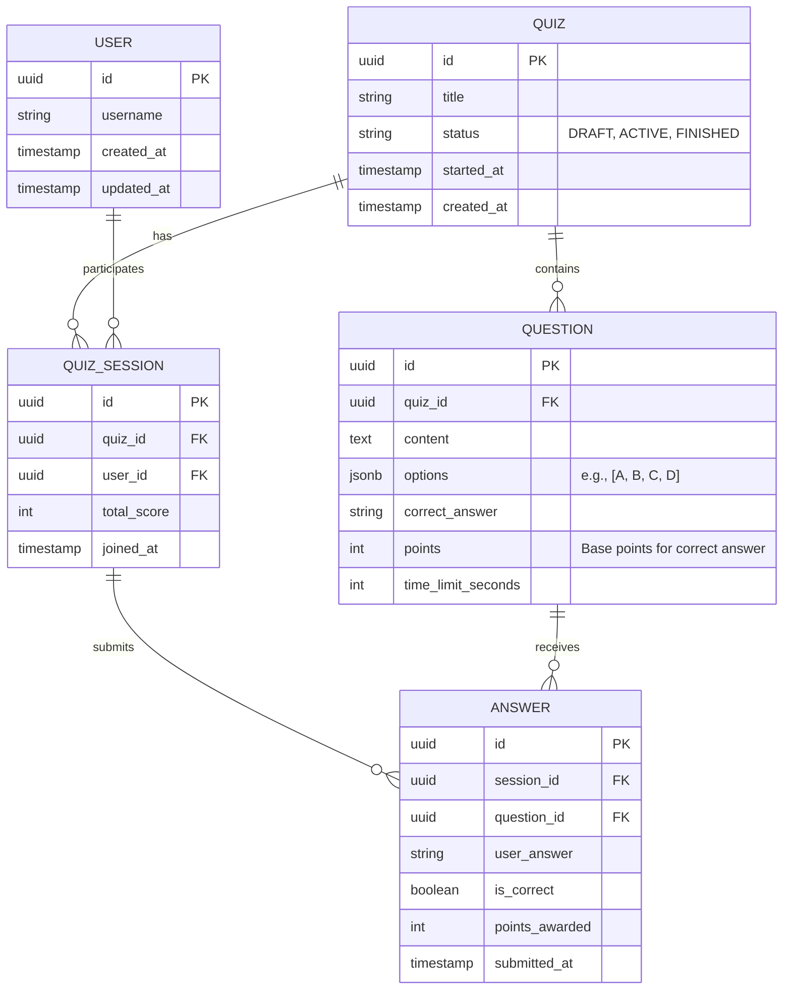

# Database Design: Real-Time Quiz Feature

The persistent storage layer uses PostgreSQL to store structured data ensuring ACID compliance for users, quizzes, and historical answers. Redis is utilized alongside it to manage the volatile real-time state of the leaderboards.

## Entity-Relationship (ER) Diagram

## PostgreSQL Tables Description

### 1. `users` Table
Stores the basic profile information of participants.
- `id` (UUID, Primary Key)
- `username` (VARCHAR)
- `created_at` / `updated_at` (TIMESTAMP)

### 2. `quizzes` Table
Maintains configuration and state data for quiz rooms.
- `id` (UUID, Primary Key)
- `title` (VARCHAR)
- `status` (ENUM: `DRAFT`, `ACTIVE`, `FINISHED`)
- `started_at` (TIMESTAMP): When the live quiz officially begins
- `created_at` / `updated_at` (TIMESTAMP)

### 3. `questions` Table
Holds the item bank attached to a specific quiz.
- `id` (UUID, Primary Key)
- `quiz_id` (UUID, Foreign Key -> `quizzes.id`): Indexed for fast lookups.
- `content` (TEXT): The vocabulary question being asked.
- `options` (JSONB): An array of possible multiple-choice options.
- `correct_answer` (VARCHAR): The string value of the correct option.
- `points` (INT): Base weight of the question.
- `time_limit_seconds` (INT): Used by the API to enforce submission windows.

### 4. `quiz_sessions` Table
The relation identifying a user joining a particular quiz session. Acts as the aggregator for historical scores.
- `id` (UUID, Primary Key)
- `quiz_id` (UUID, Foreign Key -> `quizzes.id`): Indexed.
- `user_id` (UUID, Foreign Key -> `users.id`): Indexed.
- `total_score` (INT): Final synchronized score evaluated at the end of the quiz.
- `joined_at` (TIMESTAMP)

*Note: A composite unique constraint on `(quiz_id, user_id)` prevents users from joining multiple times and resetting their score maliciously.*

### 5. `answers` Table
Detailed tracking of every submitted answer for historical analytics and dispute resolution.
- `id` (UUID, Primary Key)
- `session_id` (UUID, Foreign Key -> `quiz_sessions.id`)
- `question_id` (UUID, Foreign Key -> `questions.id`)
- `user_answer` (VARCHAR): What the user selected.
- `is_correct` (BOOLEAN): Auto-populated during calculation logic.
- `points_awarded` (INT): Evaluated value (could factor in remaining time).
- `submitted_at` (TIMESTAMP)

## Redis Schema (In-Memory Key-Value)

Since PostgreSQL is not fast enough to accommodate frequent updates during sudden traffic bursts, Redis manages the volatile real-time scoring data.

### 1. Live Leaderboard (Sorted Set)
Tracks the real-time leaderboard rankings utilizing the `ZSET` structure in Redis.
- **Key**: `quiz:{quiz_id}:leaderboard`
- **Member**: `{user_id}`
- **Score**: `{current_points}`

*Commands heavily used*: `ZADD` (to initialize), `ZINCRBY` (to increment upon correct answer), `ZREVRANGE` (to retrieve the top 10 users rapidly).

### 2. Live Quiz State (Hash)
Occasionally, reading question configurations from DB can be slow. State metadata for the live quiz is cached heavily during Active conditions.
- **Key**: `quiz:{quiz_id}:state`
- **Fields**: 
  - `status`: `ACTIVE`
  - `current_question_id`: `e8f-43...`
  - `question_start_timestamp`: `17133342...`

### 3. Pub/Sub Channels
Event distribution channels so distributed instances sync WebSockets smoothly.
- **Channel**: `channel:quiz:{quiz_id}:updates`
- **Payload Example**: `{"event": "leaderboard_update", "data": [{"user_id": "...", "score": 250, "rank": 1}]}`
