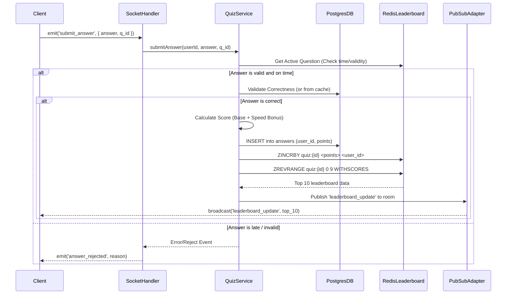

# Detailed Design: Real-Time Quiz Feature

This document covers the low-level implementation details, folder structures, core algorithms, and strategies for handling race conditions and scalability within the Node.js + Express backend.

## 1. Backend Application Structure (Node.js + Express)

The backend is structured using a strict Domain-Driven Design (DDD) approach, grouped by features (modules) rather than technical layers. This ensures that each domain encapsulates its own business logic, storage operations, and transport boundaries.

```text
src/
├── config/             # Global configurations (DB, Redis, env vars)
├── core/               # Shared utilities, common middlewares, base classes
├── modules/            # Feature modules (Domain-Driven Design)
│   ├── auth/           # Authentication domain
│   │   ├── controllers/
│   │   ├── services/
│   │   └── repositories/
│   ├── quiz/           # Core quiz management domain
│   │   ├── controllers/
│   │   ├── services/
│   │   ├── repositories/
│   │   └── models/
│   ├── realtime/       # WebSocket and live-session domain
│   │   ├── gateways/   # Socket.io event listeners and emitters
│   │   └── middlewares/# Socket authentication
│   └── leaderboard/    # Leaderboard mechanics and Redis interactions
│       ├── services/
│       └── redis/      # ZSET modifications and querying
└── app.ts              # Express/Socket.io initialization & module aggregation

### 1.1 Testing Strategy
The `__tests__` directory must strictly mirror the structure of the `src` directory it is testing. This ensures that every component has a predictable location for its associated tests.
- `src/app.ts` → `src/__tests__/app.test.ts`
- `src/modules/quiz/services/quiz.service.ts` → `src/__tests__/modules/quiz/services/quiz.service.test.ts`
- `src/config/db.ts` → `src/__tests__/config/db.test.ts`
```

## 2. Frontend Application Structure (Vue.js + PrimeVue)

The frontend is built using Vue.js for robust reactivity and PrimeVue as the UI component library, allowing rapid development of an aesthetic, responsive interface.

```text
src/
├── assets/             # Static assets, PrimeVue theme overrides, custom CSS
├── components/         # Reusable UI components (Buttons, Modals, Cards)
│   ├── quiz/           # Quiz specific components (QuestionCard, Timer)
│   └── shared/         # Generic components
├── views/              # Page level components (Lobby, QuizRoom, LeaderboardView)
├── composables/        # Vue 3 Composition API hooks (useSocket, useQuiz)
├── store/              # State management (Pinia - managing user state & scores)
├── services/           # API clients and Socket.io client wrapper
├── router/             # Vue Router configuration
└── App.vue             # Root component

### 2.1 Testing Strategy
Similar to the backend, the frontend `__tests__` directory must mirror the `src` directory structure.
- `src/App.vue` → `src/__tests__/App.spec.ts`
- `src/components/quiz/QuestionCard.vue` → `src/__tests__/components/quiz/QuestionCard.spec.ts`
- `src/composables/useSocket.ts` → `src/__tests__/composables/useSocket.spec.ts`
```

### 2.1 State Management & Reactivity
* **Pinia**: Used for global state management to store the current user's profile, active quiz session details, and real-time leaderboard data.
* **Socket.io-client**: Wrapped inside a Vue Composable (`useSocket.ts`) allowing components to effortlessly map `leaderboard_update` events directly to Vue reactive `ref`s.

### 2.2 PrimeVue Integration
* **DataTable / VirtualScroller**: Used to efficiently render the leaderboard list, ensuring 60fps scrolling even if there are hundreds of participants.
* **ProgressBar**: Used for the smooth countdown timer on each question.
* **Toast**: Utilized for immediate notifications (e.g., "Player X joined", "Answer correct! +500 points").

## 3. Core Workflow: Answer Submission & Leaderboard Update

This sequence diagram illustrates the exact internal hops that happen deep within the backend when an answer is submitted.



## 4. Core Algorithms and Optimizations

### 4.1 Scoring Algorithm
To make the quiz engaging, points are awarded based on correctness and response time.
* **Base Points**: Fixed points for the question (e.g., `1000` points).
* **Speed Multiplier**: 
  $$ \text{Points} = \text{Base Points} \times \left( \frac{\text{Time Remaining}}{\text{Total Time Allowed}} \right) $$
* **Implementation Limits**: Handled gracefully using timestamps tracked from Redis when the `question_started` event was fired. Time deltas are always calculated on the **Server-side** to prevent client spoofing.

### 4.2 Leaderboard Broadcast Debouncing / Throttling
In a quiz with 10,000 concurrent players, computing and pushing `leaderboard_update` on every single correct answer creates an immediate CPU/Network bottleneck, firing up to 10,000 WebSocket events per second.

**Solution: Throttled Broadcasting**
- When `ZINCRBY` is executed successfully, it flags the room as "dirty".
- A chron job or interval loop per-process evaluates rooms every `500ms`.
- If a room is "dirty", the server queries `ZREVRANGE` and broadcasts *once* to all clients.
- This creates smooth visual updates and cuts outbound network traffic by up to 95%.

## 5. Handling Concurrency and Real-time Edge Cases

### 5.1 Idempotent Submissions (Double Tapping)
To prevent users from gaining infinite points by double-tapping the correct answer incredibly fast during high-latency connections:
- A Redis Key is created upon first submission: `SETNX quiz:{quiz_id}:answered:{question_id}:{user_id} 1`
- `SETNX` (Set if Not eXists) is atomic. If it returns `0`, the logic aborts; the user has already answered this specific question.
- Provides robust anti-cheat mechanics without hitting PostgreSQL constraints on every tap.

### 5.2 Cross-Node WebSocket Pub/Sub
Since Express will be scaled horizontally via Load Balancers, two users in the exact same quiz might be connected to `Server A` and `Server B`.
- **Implementation**: We will embed `@socket.io/redis-adapter` into the Socket.io initialization.
- Every Node.js process listens to a shared Redis cluster. When Server A broadcasts a message to 'Room_1', the adapter automatically publishes it to Redis, signaling Server B to also emit the exact same event over its local websockets attached to 'Room_1'.

## 6. Security & Availability

* **Connection Throttling**: The Express server will employ IP Rate Limiting for the initial REST API payloads avoiding DDoS during the initial loading phase.
* **ORM & Database Connection Pooling**: We will utilize **Prisma ORM** for PostgreSQL data access. Prisma provides excellent TypeScript type safety, declarative schema definitions, and built-in connection pooling. In massive serverless or containerized deployments, an external pooler like `pgBouncer` can be layered underneath to manage connections efficiently.
* **Graceful Failure**: If PostgreSQL crashes, the Quiz must survive. Live answers check against Redis (which contains the current state and correct answer payload cached). Answers are pushed to a Redis Queue (`LPUSH`) and background workers attempt to sync it to PostgreSQL asynchronously so the game flow is never interrupted.
