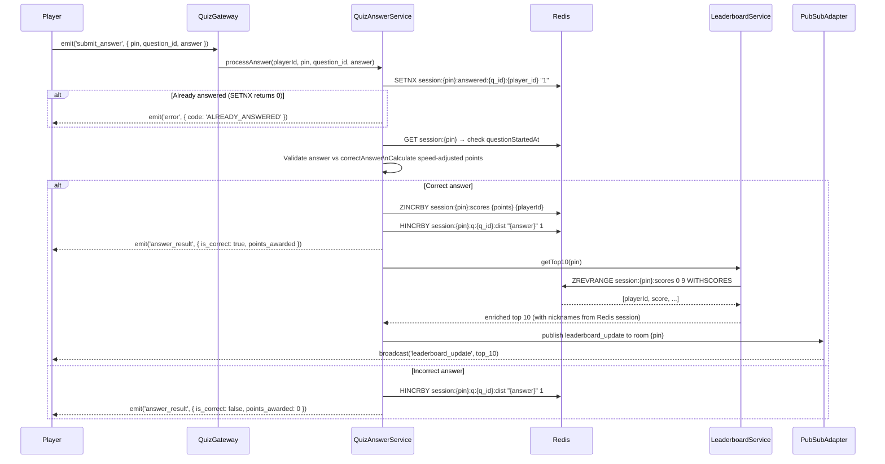

# Detailed Design: Real-Time Quiz Feature

This document covers low-level implementation details, folder structures, core algorithms, and strategies for handling race conditions and scalability in the Node.js backend.

---

## 1. Backend Application Structure (Node.js + TypeScript)

The backend uses a **Domain-Driven Design (DDD)** approach — modules are grouped by domain (feature) rather than technical layer. Each domain owns its business logic, storage operations, and transport boundaries.

```text
src/
├── config/                   # Global configurations (DB, Redis, env vars)
├── core/                     # Shared utilities, base classes, common middleware
├── modules/
│   ├── quiz/                 # Quiz template domain
│   │   ├── controllers/      # REST: GET /api/v1/quizzes, GET /api/v1/quizzes/:id
│   │   ├── services/         # QuizService, QuizAnswerService, ScoringService
│   │   └── repositories/
│   ├── session/              # Game room / session domain (NEW)
│   │   ├── controllers/      # REST: POST /api/v1/sessions, GET /api/v1/sessions/:pin
│   │   ├── services/         # SessionService (PIN gen, Redis CRUD)
│   │   └── session.types.ts  # GameSession, PlayerSession interfaces
│   ├── realtime/             # WebSocket and live-session domain
│   │   ├── gateways/         # QuizGateway (Socket.io event handlers)
│   │   ├── guards/           # MasterGuard (role-based socket permission)
│   │   ├── services/         # GameFlowService (question loop, timers)
│   │   └── types/            # Socket.data type extensions
│   └── leaderboard/          # Leaderboard mechanics and Redis interactions
│       ├── services/         # LeaderboardService
│       └── redis/            # ZSET operations
└── app.ts                    # Express/Socket.io initialization & module aggregation
```

### 1.1 Testing Strategy
The `__tests__` directory mirrors the `src` directory exactly:
- `src/modules/session/services/session.service.ts` → `src/__tests__/modules/session/services/session.service.test.ts`
- `src/modules/realtime/gateways/quiz.gateway.ts` → `src/__tests__/modules/realtime/gateways/quiz.gateway.test.ts`
- `src/modules/realtime/services/game-flow.service.ts` → `src/__tests__/modules/realtime/services/game-flow.service.test.ts`

---

## 2. Frontend Application Structure (Vue.js + PrimeVue)

```text
src/
├── assets/                   # Static assets, PrimeVue theme overrides, custom CSS
├── components/
│   ├── quiz/                 # QuestionCard, TimerBar, AnswerOption, DistributionBar
│   ├── lobby/                # PlayerCard, PlayerList, PinDisplay
│   └── shared/               # GenericModal, LoadingSpinner, ConfettiEffect
├── views/
│   ├── HomePage.vue          # Choose: Host or Join
│   ├── CreatePage.vue        # Master: pick quiz template
│   ├── HostDashboard.vue     # Master: waiting room + in-game controls + results
│   ├── JoinPage.vue          # Player: enter PIN + nickname
│   ├── LobbyPage.vue         # Player: waiting room
│   ├── PlayPage.vue          # Player: question answering (replaces QuizRoom.vue)
│   └── ResultsPage.vue       # All: final leaderboard
├── composables/
│   ├── useSocket.ts          # Socket.io client wrapper + event handlers
│   └── useGameTimer.ts       # Client-side countdown composable
├── store/
│   ├── user.ts               # Current player's nickname, role, playerId, pin
│   ├── session.ts            # Game room state: pin, players[], status, quizTitle
│   └── quiz.ts               # In-game state: current question, timer, leaderboard
├── services/
│   └── api.ts                # REST API client (fetch wrapper)
├── router/
│   └── index.ts              # Vue Router config + navigation guards
└── App.vue
```

### 2.1 State Management
- **`userStore`**: Holds the current user's identity for the session (nickname, role, playerId, pin). Persisted to `sessionStorage` for page-refresh resilience.
- **`sessionStore`**: Holds room-level state (player list, quiz title, status). Updated by socket events.
- **`quizStore`**: Holds in-game state (current question, time remaining, leaderboard, user score).
- **Socket.io-client** is wrapped in `useSocket.ts` composable — a singleton that maps incoming server events directly to Pinia store mutations.

### 2.2 PrimeVue Integration
- **`DataTable` / `TransitionGroup`**: Animated leaderboard list with smooth re-ordering.
- **`ProgressBar`**: Countdown timer visualization per question.
- **`Toast`**: Immediate feedback on answer submission ("+850 pts!" / "Wrong!").
- **`Dialog`**: Confirmation dialogs for "End Quiz" and host-disconnected alerts.

---

## 3. Core Workflow: Answer Submission & Leaderboard Update



---

## 4. Core Algorithms

### 4.1 Speed-Based Scoring
Points are awarded based on correctness and how quickly the player answered:

$$\text{Points} = \text{Base Points} \times \left( \frac{\text{Time Remaining}}{\text{Total Time Allowed}} \right)$$

- `questionStartedAt` is stored in Redis when `question_started` is broadcast.
- Time delta is always computed **server-side** using `Date.now() - questionStartedAt` to prevent client clock manipulation.
- Minimum points for a correct answer: 100 (prevents 0-point correct answers on timeout edge cases).

### 4.2 Leaderboard Broadcast Throttling
In rooms with many players, broadcasting after every correct answer could generate excessive traffic.

**Solution — Throttled Broadcasting:**
- After each `ZINCRBY`, flag the room PIN as "dirty" in a local `Set`.
- A `setInterval` running every 500ms checks all dirty rooms, fetches `ZREVRANGE`, and broadcasts once.
- This reduces outbound traffic by up to 95% during high-concurrency bursts.

### 4.3 PIN Generation
```typescript
function generatePin(): string {
  return Math.floor(100000 + Math.random() * 900000).toString();
}
// Uniqueness: check Redis key `session:{pin}` existence via EXISTS command
// Retry up to 5 times; throw if all collide (statistically near-impossible)
```

---

## 5. Concurrency & Edge Case Handling

### 5.1 Idempotent Answer Submission
Prevents double-scoring from network retries or rapid tapping:
```
SETNX session:{pin}:answered:{question_id}:{player_id} "1"  (TTL: 3600s)
```
`SETNX` is atomic. Returns `0` if the key already exists → processing aborts immediately. No DB writes or score increments occur.

### 5.2 Cross-Node WebSocket Pub/Sub
When scaled horizontally, players in the same room may be connected to different server nodes:
- **`@socket.io/redis-adapter`** is configured at startup.
- When Node A calls `io.to(pin).emit(...)`, the adapter publishes to Redis channel `channel:session:{pin}:updates`.
- Node B, subscribed to the same channel, receives and re-emits the event to its local sockets in that room.

### 5.3 Master Reconnect
- On `session_created`, server signs a short-lived JWT (`masterToken`) containing `{ pin, gameRoomId }` and returns it to the master client.
- Client stores `masterToken` in `localStorage`.
- On reconnect, master emits `reclaim_host { pin, masterToken }`.
- Server verifies the JWT, resets `session.masterSocketId` to the new socket ID, and restores host privileges.
- Token expires after 1 hour (configurable).

### 5.4 Late-Joining Player (Re-join)
If a player disconnects mid-game and returns:
- Client calls `GET /api/v1/sessions/:pin` — gets current status and question index.
- Client emits `rejoin_quiz { pin, playerId, nickname }`.
- Server re-adds the socket to the room, restores score from Redis ZSET, and sends the current `question_started` state.

---

## 6. Security & Availability

- **Master Permission Check**: Every control event (`start_quiz`, `end_quiz`, `next_question`) validates `socket.id === session.masterSocketId` retrieved from Redis — not a field the client can fake.
- **Connection Throttling**: IP rate limiting on REST endpoints (`express-rate-limit`) to prevent PIN brute-forcing and DDoS on session creation.
- **Answer Window Enforcement**: Correct answers submitted after `questionStartedAt + time_limit_seconds * 1000` are rejected server-side, even if the client's timer hasn't expired yet.
- **Prisma ORM + Connection Pooling**: Used for all PostgreSQL interactions. External `pgBouncer` can be layered in for high-load deployments.
- **Graceful Redis Fallback**: If PostgreSQL is temporarily unavailable, the live game continues using Redis-cached state. Answers are queued and synced to DB after recovery.
