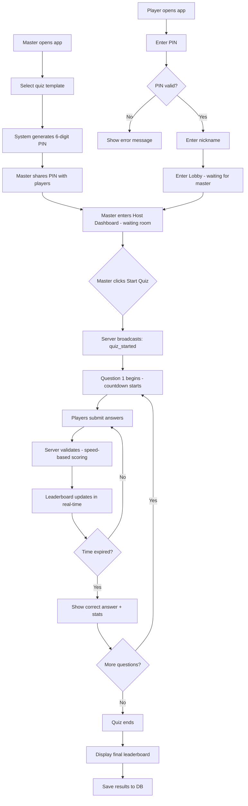
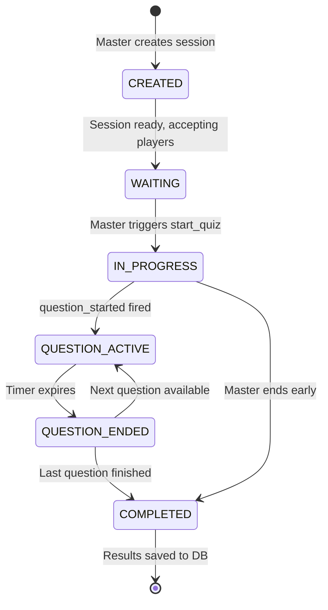
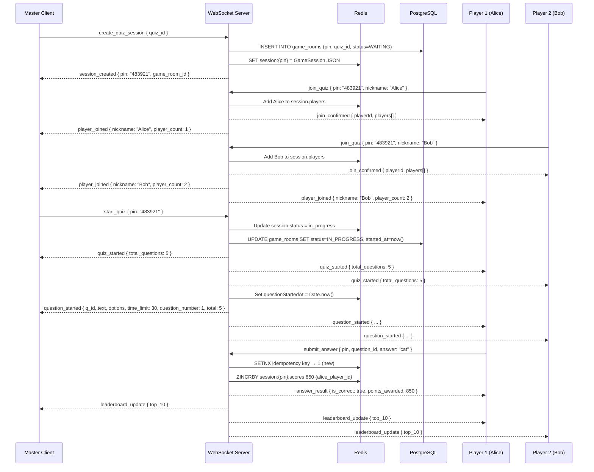

# Flow Design: Slido-Like Real-Time Quiz

## Overview

The game follows a **Slido-style host-and-join model**: a **Master** creates a quiz room and receives a 6-digit PIN, **Players** join by entering that PIN and choosing a nickname, then wait in a lobby until the master starts the game. The entire experience is real-time via WebSocket.

---

## 1. User Roles

### 1.1 Master
- Creates a quiz session from an existing quiz template.
- Receives a **6-digit PIN** to share with players.
- Has a **Host Dashboard** to:
  - View the live player list in the waiting room.
  - Control game flow: start, (optionally) advance questions, end early.
  - See per-question answer distribution after time runs out.
- **Only the master can trigger `start_quiz`.**

### 1.2 Player
- Receives the PIN from the master (out-of-band: Slack, chat, screen, etc.).
- Navigates to the join page, enters PIN + a display **nickname**.
- Waits in the **Lobby Screen** until the master starts.
- Answers questions within the time limit.
- Sees real-time score feedback and leaderboard.

---

## 2. Full Game Flow



---

## 3. Screen States

### 3.1 Master Flow
```
[Home] → [Create — Select Quiz] → [Host Dashboard — Waiting Room]
       → [Host Dashboard — In-Game Controls] → [Post-Game Results]
```

### 3.2 Player Flow
```
[Home] → [Join — Enter PIN] → [Join — Enter Nickname] → [Lobby — Waiting]
       → [Play — Question Screen] → [Play — Post-Answer Feedback]
       → [Play — Leaderboard] → [Results — Final Standings]
```

---

## 4. WebSocket Events

### 4.1 Client → Server

| Event | Sender | Payload | Description |
|-------|--------|---------|-------------|
| `create_quiz_session` | Master | `{ quiz_id }` | Master creates a new game room |
| `join_quiz` | Player | `{ pin, nickname }` | Player joins using PIN |
| `start_quiz` | Master | `{ pin }` | Begins the quiz for all players |
| `next_question` | Master | `{ pin }` | Manually advance (if auto-advance disabled) |
| `submit_answer` | Player | `{ pin, question_id, answer }` | Player submits answer |
| `end_quiz` | Master | `{ pin }` | Master ends quiz early |

### 4.2 Server → Client

| Event | Recipients | Payload | Description |
|-------|-----------|---------|-------------|
| `session_created` | Master | `{ pin, game_room_id, quiz_title }` | Confirms room creation |
| `player_joined` | Master + All Players | `{ nickname, player_count, players[] }` | A new player joined |
| `player_left` | Master + All Players | `{ nickname, player_count }` | A player disconnected |
| `quiz_started` | All | `{ total_questions }` | Quiz has begun |
| `question_started` | All | `{ question_id, text, options[], time_limit, question_number, total }` | New question starts |
| `answer_result` | Player (individual) | `{ is_correct, points_awarded, correct_answer }` | Personal answer feedback |
| `question_ended` | All | `{ correct_answer, answer_distribution }` | Question time-up + stats |
| `leaderboard_update` | All | `{ top_10: [{ rank, nickname, score }] }` | Real-time leaderboard |
| `quiz_completed` | All | `{ final_leaderboard[] }` | Quiz finished |
| `host_disconnected` | All Players | `{}` | Master went offline |
| `error` | Requester | `{ code, message }` | Error response |

---

## 5. Session State Machine



---

## 6. Runtime Data Models

### 6.1 GameSession (Redis — ephemeral)
```typescript
interface GameSession {
  id: string;               // UUID (maps to GameRoom.id in DB)
  pin: string;              // 6-digit PIN
  quizId: string;           // FK to Quiz template
  gameRoomId: string;       // FK to GameRoom (DB record)
  status: 'waiting' | 'in_progress' | 'completed';
  currentQuestionIndex: number;
  questionStartedAt: number; // Unix ms timestamp — for speed scoring
  players: Record<string, PlayerSession>; // key: socketId
}
```

### 6.2 PlayerSession (Redis — ephemeral)
```typescript
interface PlayerSession {
  playerId: string;     // UUID generated at join time
  socketId: string;
  nickname: string;
  score: number;
  joinedAt: number;     // Unix ms timestamp
}
```

### 6.3 GameRoom (PostgreSQL — persistent)
Lives in DB for record-keeping; created when master creates session, status updated throughout game. See `db_design.md` for full schema.

---

## 7. PIN Generation & Session Lifecycle

- **PIN format**: 6 digits (`000000`–`999999`), checked for uniqueness among active Redis sessions.
- **Collision handling**: If PIN collides, regenerate (max 5 attempts).
- **Redis TTL**: All session keys expire after **2 hours** of inactivity.
- **Player reconnect**: Player can re-enter PIN + same nickname to rejoin an in-progress game.
- **Master reconnect**: A `masterToken` (short-lived JWT) is stored in `localStorage` and used to reclaim host privileges on page reload.

```
Redis Key Namespace (by PIN):
  session:{pin}                              → GameSession JSON        (TTL: 2h)
  session:{pin}:scores                       → ZSET leaderboard        (TTL: 2h)
  session:{pin}:q:{question_id}:dist         → HASH answer distribution (TTL: 1h)
  session:{pin}:answered:{q_id}:{player_id}  → "1" idempotency flag    (TTL: 1h)
```

---

## 8. Permission Model

| Action | Master | Player | Server Validation |
|--------|--------|--------|-------------------|
| Create session | ✅ | ❌ | No auth required (any client can be master) |
| Start quiz | ✅ | ❌ | `socket.data.masterSocketId === socket.id` |
| Advance question | ✅ | ❌ | Same — master socket check |
| End quiz early | ✅ | ❌ | Same — master socket check |
| Submit answer | ❌ | ✅ | `socket.data.role === 'player'` + session `in_progress` |
| View leaderboard | ✅ | ✅ | Public within the room |

---

## 9. Frontend Routes

```
/                   → HomePage       (choose: Host or Join)
/create             → CreatePage     (Master: pick quiz, create session)
/host/:pin          → HostDashboard  (Master: waiting room + in-game controls)
/join               → JoinPage       (Player: enter PIN)
/lobby/:pin         → LobbyPage      (Player: waiting for master)
/play/:pin          → PlayPage       (Player: answer questions)
/results/:pin       → ResultsPage    (All: final leaderboard)
```

---

## 10. Detailed Sequence: Join & Start Flow



---

## 11. Changes from Previous Design

| Aspect | Old Design | New Design (Slido-like) |
|--------|-----------|------------------------|
| Join flow | Player browses quiz list from DB | Player enters 6-digit PIN |
| Player identity | `User` record in PostgreSQL | Ephemeral nickname (no account) |
| Quiz start | Auto-starts on page load | Master clicks "Start Quiz" |
| Waiting room | Not present | Lobby screen with live player list |
| Roles | No differentiation | Master vs Player |
| Session concept | `QuizSession` (user + quiz join record) | `GameRoom` (live room) + `PlayerResult` (post-game) |
| Host controls | Not present | Full host dashboard |
| PIN | Not present | 6-digit PIN |
| Player reconnect | Not supported | Supported via PIN + nickname |
| DB for users | Required (`users` table) | Not required (guests only) |
