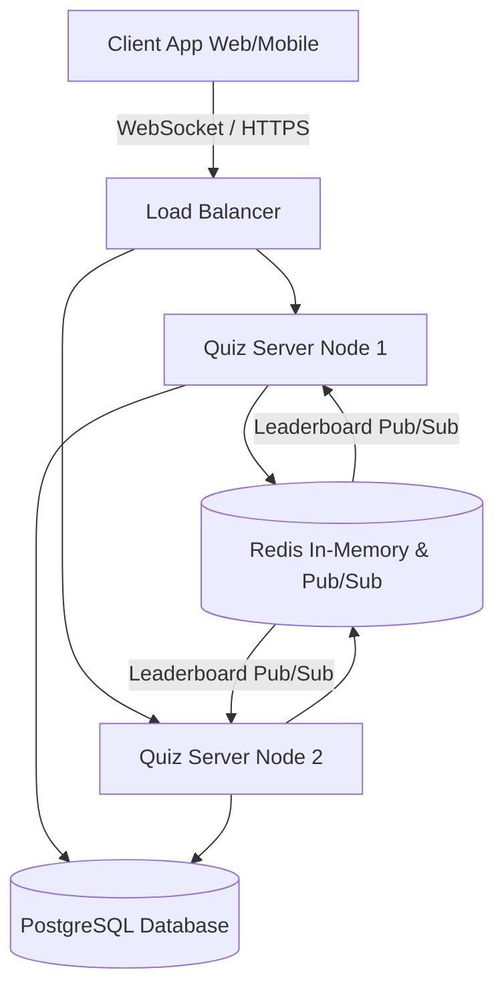

# System Design: Real-Time Quiz Feature

Based on the acceptance criteria, the system needs to support multiple users joining a quiz simultaneously, update scores in real-time as users submit answers, and present an accurate real-time leaderboard.

## Architecture Diagram

## Component Description

1. **Client Apps (Web/Mobile)**: The front-end applications where users participate in the quiz. It maintains a persistent WebSocket connection with the backend servers. The client renders the questions, handles user inputs (answers), and updates the UI (scores and leaderboard) immediately upon receiving server events.
2. **Load Balancer**: The entry point for all traffic. It distributes incoming HTML/REST API requests and WebSocket connections across the horizontally scaled Quiz Server nodes.
3. **Quiz Servers (API & WebSocket Backend)**: The core backend instances handling the business logic. Responsibilities include validating users joining specific quiz IDs, managing active WebSocket connections, validating submitted answers, computing score increments, and dispatching events back to the clients.
4. **Redis**: Used as an in-memory database component serving two critical functions:
   - **Real-Time Leaderboard Engine**: Utilizes Redis Sorted Sets (`ZSET`) to store user scores. Sorted sets naturally maintain a descending list of the highest values, ensuring O(log(N)) complexity for updates and retrievals.
   - **Distributed Event Bus (Pub/Sub)**: Ensures that a score upgrade triggered on "Server Node 1" pushes a leaderboard update out across all other nodes, so every participant receives the updated sync, regardless of what container they are connected to.
5. **PostgreSQL Database**: The durable persistent storage layer. It holds long-term transactional structured data, such as:
   - User profiles and configurations.
   - Quiz definitions (questions, possible options, correct answers).
   - Historical quiz session records and aggregated user performance.

## Data Flow

1. **Joining a Quiz**:
   - The user opens the app and inputs a Quiz ID.
   - The Client App initiates a WebSocket connection routed to a specific Quiz Server.
   - The Quiz Server authenticates the user, reads the Quiz configuration from the Database, and adds the WebSocket connection to a "Room" corresponding to the Quiz ID.
   - The Server initializes the user's score in the Redis Sorted Set (`ZADD`) with 0 points.
   - The Server broadcasts a `player_joined` event with the updated participant list to everyone in that room.
2. **Submitting an Answer**:
   - The participant submits an answer for the current question via the WebSocket.
   - The Quiz Server validates the incoming answer by comparing it against the correct answer stored in memory (cached from the Database).
   - If correct, the Quiz Server calculates the points awarded (which can be fixed or based on response speed).
3. **Leaderboard Update & Broadcasting**:
   - The Quiz Server atomically increments the specific user's score in the Redis Sorted Set using `ZINCRBY`.
   - The Quiz Server quickly requests the newly updated top leaderboard from Redis using `ZREVRANGE`.
   - The updated leaderboard payload is published to a Redis Pub/Sub channel tied to the specific Quiz ID.
   - All interconnected Quiz Servers listen to this channel. They receive the new leaderboard and immediately emit (`broadcast`) a `leaderboard_updated` WebSocket event to all Client instances residing in the specific room.
   - The Client Apps receive the payload and instantly re-render the leaderboard.

## Technologies and Tools

- **Backend Logic: Node.js + TypeScript (Express)**
  - *Justification*: Node.js’s event-driven, non-blocking I/O model handles high-concurrency open connections efficiently. It dominates the ecosystem for real-time WebSocket infrastructure.
- **Real-Time Communication Layer: Socket.io**
  - *Justification*: Provides a resilient real-time bidirectional layer that works flawlessly with WebSockets but contains gracefully degrading fallbacks. Out of the box, it provides room segregation (perfect for parallel quizzes) and standardizes events.
- **In-Memory Store & Pub/Sub: Redis**
  - *Justification*: Key for scalability and performance. Redis Sorted Sets (`ZSET`) eliminate the overhead of calculating rankings using heavy SQL queries on normal DBs. The Pub/Sub layer solves the problem of cross-node WebSocket messaging.
- **Primary Database: PostgreSQL with Prisma ORM**
  - *Justification*: PostgreSQL provides a scalable, ACID-compliant relational DB. Using Prisma as the ORM guarantees end-to-end type safety with TypeScript, auto-generated migrations, and an extremely fast, developer-friendly database access layer.
- **Containerization & Orchestration: Docker + Kubernetes**
  - *Justification*: Real-time systems experience sudden spikes in traffic (e.g., thousands of people joining a quiz concurrently). Kubernetes allows horizontal pod autoscaling based on memory usage or connection count metrics.
