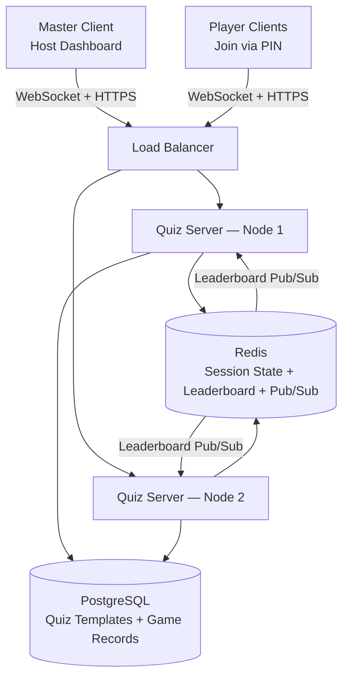

# System Design: Real-Time Quiz Feature

The system supports multiple users joining a quiz room simultaneously in a **Slido-like model**: a Master creates a room with a PIN, Players join using that PIN, and the Master controls the game lifecycle. Scores update in real-time and a live leaderboard reflects current standings.

---

## Architecture Diagram

---

## Component Description

1. **Master Client (Host Dashboard)**: A browser session that creates game rooms, receives a 6-digit PIN, monitors joining players, and controls the quiz flow (start, end). Communicates via WebSocket for real-time events and REST for session creation.

2. **Player Clients**: Browser sessions where participants enter the PIN and a nickname, then answer questions in real-time. No account registration required — players are anonymous guests for the session.

3. **Load Balancer**: Entry point for all traffic. Distributes HTTP/REST and WebSocket connections across horizontally scaled server nodes. Must support **sticky sessions** or a shared state layer (Redis) for WebSocket routing.

4. **Quiz Servers (API + WebSocket Backend)**: Core backend instances handling:
   - PIN generation and session creation
   - Master/Player role authentication per socket connection
   - Game flow orchestration (question timers, answer validation, leaderboard updates)
   - Dispatching events back to clients in the correct room

5. **Redis**: In-memory store serving three critical functions:
   - **Session State**: Full `GameSession` JSON (player list, current question, timestamps) stored per PIN with TTL.
   - **Real-Time Leaderboard Engine**: Redis Sorted Sets (`ZSET`) for O(log N) score updates and instant top-N retrieval.
   - **Distributed Event Bus (Pub/Sub)**: Ensures leaderboard updates triggered on Node 1 are relayed to all clients connected to Node 2.

6. **PostgreSQL Database**: Durable persistent storage for:
   - Quiz templates and questions (cold data, read-heavy)
   - `GameRoom` records (PIN, status, timing — created at session start, updated at completion)
   - `PlayerResult` records (nickname, final score, rank — written only at game end)
   - `Answer` records (individual answer history for analytics)

---

## Data Flow

### 1. Creating a Game Room (Master)
- Master selects a quiz template and triggers `POST /api/v1/sessions { quiz_id }`.
- Server generates a unique 6-digit PIN, inserts a `GameRoom` record in PostgreSQL (`status = WAITING`), and initializes the Redis session object.
- Master receives the PIN and navigates to the Host Dashboard.

### 2. Joining a Room (Player)
- Player enters the PIN on the Join page; client validates via `GET /api/v1/sessions/:pin`.
- Player enters a nickname and the client emits `join_quiz { pin, nickname }` via WebSocket.
- Server assigns a `playerId`, adds the player to the Redis session, initializes their score in the Redis ZSET (`ZADD session:{pin}:scores 0 {playerId}`), and broadcasts `player_joined` to the entire room.

### 3. Starting the Quiz (Master)
- Master emits `start_quiz { pin }`.
- Server validates that the socket is the registered master socket, updates Redis and DB status to `IN_PROGRESS`, and delegates to `GameFlowService`.
- `GameFlowService` broadcasts `quiz_started` then immediately broadcasts `question_started` for question 0.

### 4. Answering Questions (Players)
- Each player emits `submit_answer { pin, question_id, answer }`.
- Server atomically checks idempotency (`SETNX`), validates correctness, calculates speed-adjusted points, and increments the Redis ZSET (`ZINCRBY`).
- The submitting player receives `answer_result { is_correct, points_awarded }`.
- A throttled broadcast sends `leaderboard_update` (top 10) to the whole room.

### 5. End of Question & Advancement
- `GameFlowService` fires `endQuestion` after the configured `time_limit`.
- Server broadcasts `question_ended { correct_answer, answer_distribution }` — clients show correct answer highlights and per-option stats.
- After a 3-second pause, the next `question_started` event is broadcast, or `endQuiz` is called.

### 6. Game Completion
- `GameFlowService.endQuiz()` broadcasts `quiz_completed { final_leaderboard }`.
- Server writes `PlayerResult` rows to PostgreSQL (nickname, final_score, rank) and updates `GameRoom.status = COMPLETED`.
- Redis keys are scheduled for cleanup after 10 minutes.

---

## Technologies and Tools

- **Backend: Node.js + TypeScript (NestJS/Express)**
  - Event-driven, non-blocking I/O for high-concurrency WebSocket connections.

- **Real-Time Communication: Socket.io**
  - Built-in room grouping (per PIN), reliable WebSocket with HTTP long-polling fallback, and the `@socket.io/redis-adapter` for cross-node event broadcasting.

- **In-Memory Store & Pub/Sub: Redis**
  - Sorted Sets (`ZSET`) for O(log N) leaderboard operations.
  - String keys + `SETNX` for atomic idempotency checks.
  - Pub/Sub for cross-node socket synchronization.

- **Primary Database: PostgreSQL with Prisma ORM**
  - ACID-compliant persistence for quiz templates and post-game records.
  - Prisma provides end-to-end TypeScript type safety and auto-generated migrations.

- **Containerization & Orchestration: Docker + Kubernetes**
  - Horizontal pod autoscaling to handle traffic spikes (e.g., hundreds of players joining simultaneously).
  - Redis cluster mode for high availability of session state.
